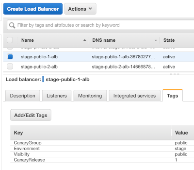
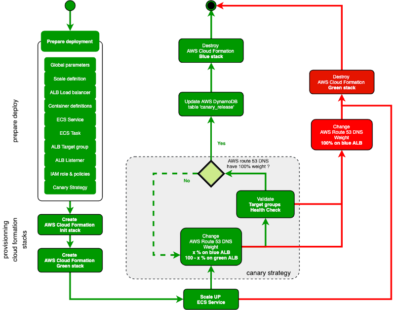
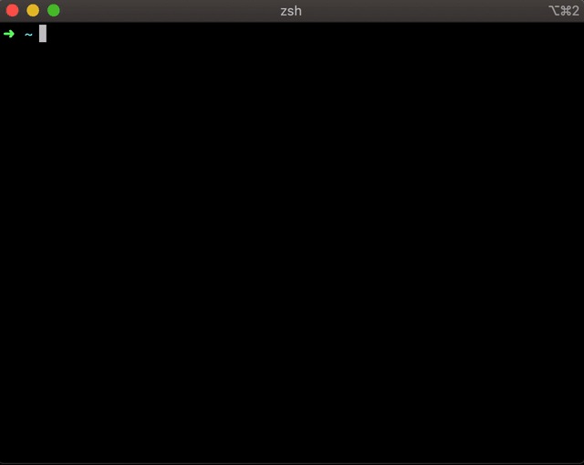
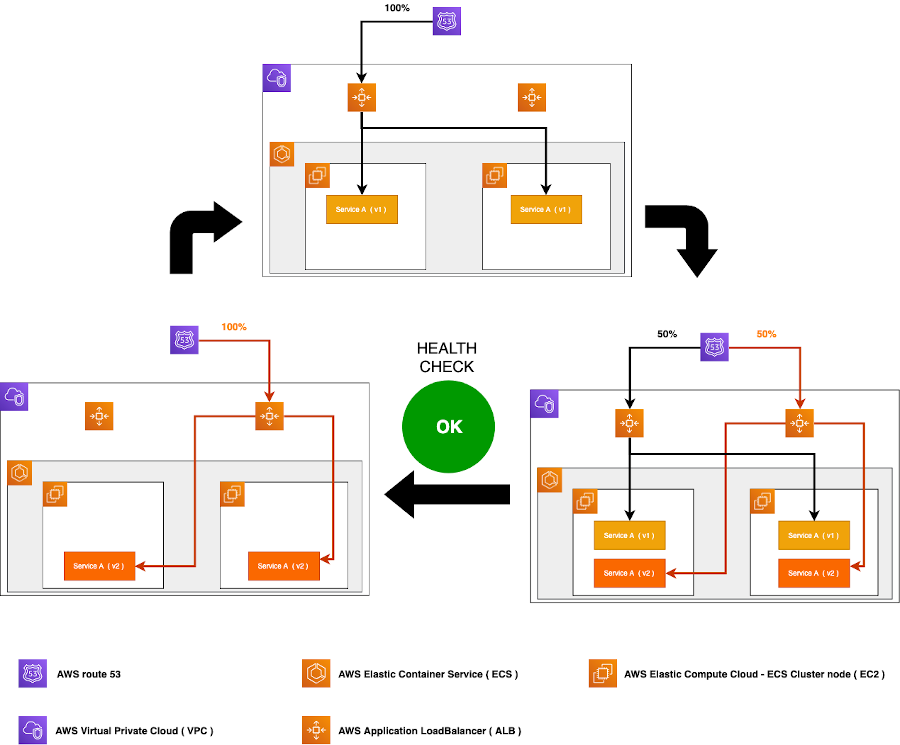
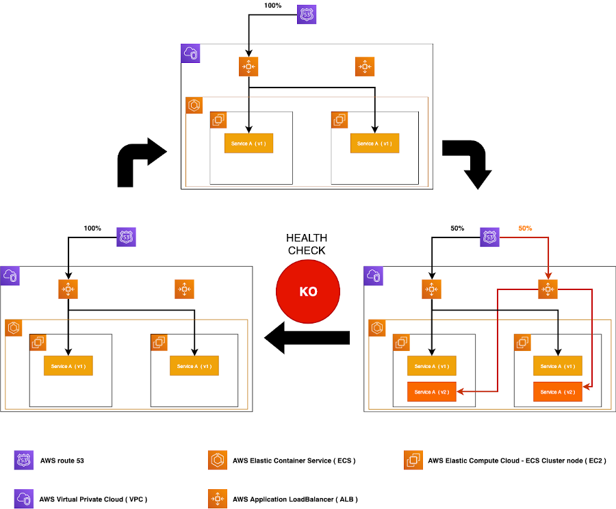
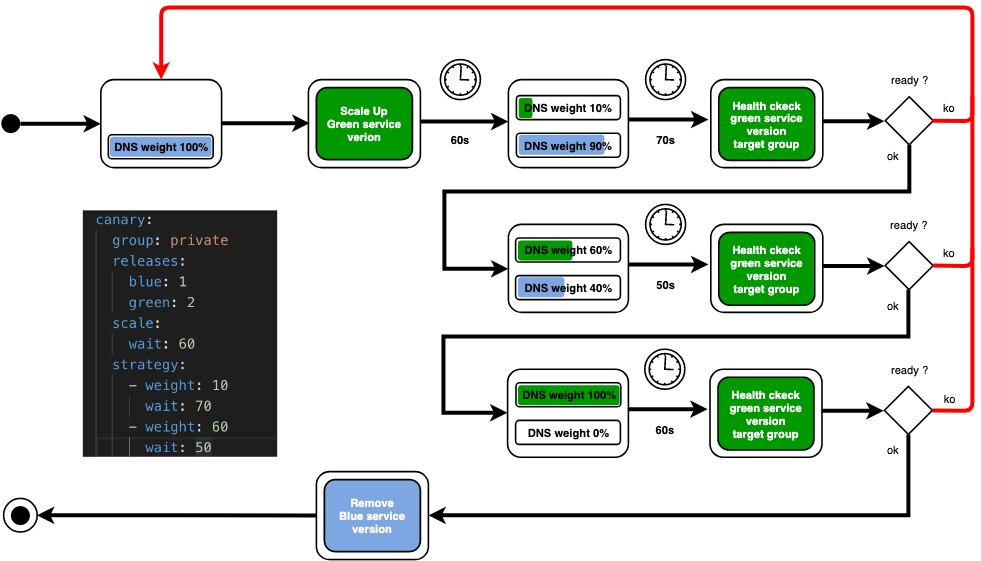
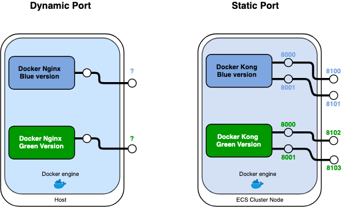

# AWS ECS Canary Release Deploy Command Line

## I - Introduction

The implementation of Zero Downtime Deployment is based on a number of patterns and best practices.

This project aims to provide a tool that runs on console to deploy ECS services using the concepts of canary release and blue/green deployment.

### I.2 - Prerequistes

To use **ecs-crd-cli**, you must have already provisioned a component set on your AWS account.

### I.2.1 - [ECS cluster](https://aws.amazon.com/ecs/?nc1=h_ls)

You need an ECS cluster containing at least two nodes. Ideally to be resilient, these two EC2 nodes need to be on two different availability zones.

To help you set up your infrastructure, I invite you to visit our github repository [terraform-module](https://github.com/AdventielFr/terraform-aws-ecs-node)

This repository gives you a good basis for provisioning your ECS cluster

### I.2.2 - [AWS Application load balancer](https://aws.amazon.com/elasticloadbalancing/?nc1=h_ls)

You need to have at least 2 AWS Application Load Balancers.These 2 application load balancers must be tagged.

In order for the blue / green deployment to be successful, it is necessary to be able to identify a pair of application load balancers. It is with the labels "CanaryGroup" and "CanaryRelease" that this is possible.



### I.2.3 - [AWS Route 53 DNS](https://aws.amazon.com/route53/?nc1=h_ls)

You need a Route 53 DNS zone that will be used to record the name of the service you will be deploying

To help you set up your infrastructure, I invite you to visit our github repository [terraform-module](https://github.com/AdventielFr/terraform-aws-route53)

### I.2.4 - [AWS Certificat Manager](https://aws.amazon.com/certificate-manager/?nc1=h_ls)

If your service is visible on the internet, which means that the application load balancers are "internet facing", you will have to apply an SSL certificate. For the dynamic provisioning of certificats, I invite you to use let's encrypt which is free.

To help you set up your infrastructure, I invite you to visit our github repository [terraform-module](https://github.com/AdventielFr/terraform-aws-lets-encrypt-renew-certificates)

## II - How is deployment done ?



## III - Installation

To install the command line tool, simply install it using pip.

```shell
pip install ecs-crd-cli
```

One of the best practices and do it using a virtualenv.

```shell
virtualenv -p python3 my-project
source my-project/bin/activate
pip install ecs-crd-cli
```



## IV - Usage

### IV.1 - How use the command line ?

#### IV.1.1 - Show help

At any time on the command line, it is possible to recover the online help. To do this, simply type --help.

#### IV.1.2 - Show  version

At any time on the command line, it is possible to recover the version. To do this, simply type version.

#### IV.1.3 - Dry run deployment file

Before deploying, it is possible to validate the configuration file. For that use the command "dry-run" of the CLI.

#### IV.1.4 Deploy a service

To deploy a service, you must use the **deploy** sub command.The arguments for using this suborder are:

| Argument (long) | Argument ( short) | Description  |
|:---|:----|:-----|
| --help | | documentation of sub command|
| --environment | -e | the environment to deploy ( the allowed values ​​are dev, qua, stage, preprod, prod ) |
| --region | -r | aws region to deploy the service |
| --configuration-file | -f | configuration file .yml use to describe the deployment|
| --configuration-dir | -d | configuration directory, if configuration-file is not set |
| --verbose | | increase the level of trace verbosity|
| --log-file | | name of the file where the traces will be written |

* If you use the **--configuration-file** argument, you do not need to fill in the --configuration-dir argument.

* If you use the **--configuration-dir** argument, the tool will look in the directory for a file of type **environment**.deploy.yml

#### IV.1.5 Undeploy a service

To undeploy a service, you must use the **undeploy** sub command. The arguments for using this suborder are the same as for the suborder **deploy**.

## V - Decribe deployment file

The description file of a deployment is file in yml format. The format of this file is the following.

### V.0 - How to formulate the deployment ?

The canary deployment is based on a declaration that is defined in a file in Yaml format. The reference file is here [see reference](_docs_/reference.yml).

### V.1 - canary tag definition

The "canary" tag contains the definition of the deployment strategy.

```yaml
canary:
  group: string
  releases:
    blue: string
    green: string
  scale:
    wait: integer
  strategy:
    - weight: integer
      wait: integer
  sns_topic_notifications:
    on_success: string
    on_fail: string

```

example,

```yaml
canary:
  group: private
  releases:
    blue: 1
    green: 2
  scale:
    wait: 60
  strategy:
    - weight: 10
      wait: 70
    - weight: 60
      wait: 50
```

#### V.1.1 - [canary].group

**description** : Information about selecting the application load balancer group used for service deployment. The **group** tag is used to identify which application load balancer group the service should deploy to. ( show AWS Application Load Balancer Tags **CanaryGroup** )

**type**: string

**optional** : false

#### V.1.2 - [canary].releases

Information about selecting the application load balancer group used for service deployment. The **release** tag identifies the two application load balancers. The values for blue and green are **CanaryRelease** labels on application load balancers.

##### V.1.2.1 - [canary.releases].blue

&nbsp;&nbsp;**description** : Identifier of the first application load balancer

&nbsp;&nbsp;**type**: string

&nbsp;&nbsp;**required** : yes

##### V.1.2.2 - [canary.releases].green

&nbsp;&nbsp;**description** : Identifier of the second application load balancer

&nbsp;&nbsp;**type** : string

&nbsp;&nbsp;**required** : yes

#### V.1.3 - [canary].scale

Information about scaling the service for deployment.

#### V.1.3.1 - [canary.scale].wait

&nbsp;&nbsp;**description** : Waiting time after scaling the number of service intances in the cluster

&nbsp;&nbsp;**type** : integer

&nbsp;&nbsp;**default** : 60

&nbsp;&nbsp;**required** : no

#### V.1.3.2 - [canary.scale].desired

&nbsp;&nbsp;**description** : The Number of desired instances of the service in the cluster

&nbsp;&nbsp;**type**: integer

&nbsp;&nbsp;**default** : 2

&nbsp;&nbsp;**required** : no

#### V.1.3.2 - [canary].strategy

Contains the definition of the service deployment strategy. A deployment strategy is composed of state that allows changing the distribution of DNS weights between application load balancers.

If during deployment of the service the new version of the service is considered as invalid, the deployment is canceled and a rollback is performed.

<table>
    <tr>
        <td>
            <strong>Deployment succed</strong>
        </td>
                <td>
            <strong>Deployment failed</strong>
        </td>
    <tr>
    <tr>
        <td>
            
        </td>
        <td>
            
        </td>
    </tr>
<table>

each of item of stategy is composed of

#### V.1.3.2.1 - [canary.strategy].weight

&nbsp;&nbsp;**description** : The weight for DNS of green application load balancers.

&nbsp;&nbsp;**type** : integer

&nbsp;&nbsp;**required** : yes

#### V.1.3.2.2 - [canary.strategy].wait

&nbsp;&nbsp;**description** : The timeout period before testing the different health checks for target groups associated with the green application load balancer.

&nbsp;&nbsp;**type** : integer

&nbsp;&nbsp;**required** : yes

Example of deployment strategy



#### V.1.4 - [canary].sns_topic_notifications

To be informed that a deployment has been completed, it is possible to define two SNS topic ARNs that will transmit the information about the deployment.

#### V.1.4.1 - [canary.sns_topic_notifications].on_success

&nbsp;&nbsp;**description** : SNS topic ARN that publishes deployment messages successfully completed.

&nbsp;&nbsp;**type** : sring

&nbsp;&nbsp;**required** : no

#### V.1.4.2 - [canary.sns_topic_notifications].on_fail

&nbsp;&nbsp;**description** : SNS topic ARN that publishes failed deployment messages.

&nbsp;&nbsp;**type** : sring

&nbsp;&nbsp;**required** : no

### V.2 - service tag definition

The "service" tag contains the definition of the service to deploy. The definition is very similar to the statement of an ECS service by AWS cloud formation

```yaml
service:
  project: string
  name: string
  cluster: string
  version: string
  scheduling_strategy: string
  platform_version: string
  placement_constraints:
    - [Placement Constraints Tag Definition]
  placement_strategies:
    - [Placement Strategy Tag Definition]
  requires_compatibilities: string
  containers:
    - [Container Tag Definition]
  cpu: integer
  memory: integer
  ipc_mode: string
  network_mode: string
  iam_roles: [IAM Role Tag Definition]
  auto_scaling: [Auto Scaling Tag Definition]
  volumes:
    - [Volume Tag Definition]

```

#### V.2.1 - [service].**project**

&nbsp;&nbsp;**description** : The project name. Once the value is filled you can use the **{{project}}** template for the other properties.

&nbsp;&nbsp;**type** : string

&nbsp;&nbsp;**required** : yes

#### V.2.2 - [service].name

&nbsp;&nbsp;**description** : The service name. Once the value is filled you can use the **{{name}}** template for the other properties.

&nbsp;&nbsp;**type**: string

&nbsp;&nbsp;**required** : yes

#### V.2.3 - [service].cluster

&nbsp;&nbsp;**description** : ECS cluster name where the service is to be deployed.

&nbsp;&nbsp;**type** : string

&nbsp;&nbsp;**required** : yes

#### V.2.4 - [service].version

&nbsp;&nbsp;**description** : Version of the service. Once the value is filled you can use the **{{fqdn}}** template for the other properties.

&nbsp;&nbsp;**type** : string

&nbsp;&nbsp;**required** : yes

#### V.2.5 - [service].scheduling_strategy

&nbsp;&nbsp;**description** : The scheduling strategy to use for the service. For more information [see AWS documentation](https://docs.aws.amazon.com/AWSCloudFormation/latest/UserGuide/aws-resource-ecs-service.html#cfn-ecs-service-schedulingstrategy)

&nbsp;&nbsp;**type** : string

&nbsp;&nbsp;**required** : no

#### V.2.6 - [service].platform_version

&nbsp;&nbsp;**description** : The platform version that your tasks in the service are running on. A platform version is specified only for tasks using the Fargate launch type. If one isn't specified, the LATEST platform version is used by default. For more information [see AWS documentation](https://docs.aws.amazon.com/AWSCloudFormation/latest/UserGuide/aws-resource-ecs-service.html#cfn-ecs-service-platformversion)

&nbsp;&nbsp;**type** : string

&nbsp;&nbsp;**required** : no

#### V.2.7 - [service].placement_constraints

&nbsp;&nbsp;**description** : An array of placement constraint objects to use for tasks in your service. For more information [see AWS documentation](https://docs.aws.amazon.com/AWSCloudFormation/latest/UserGuide/aws-resource-ecs-service.html#cfn-ecs-service-placementconstraints)

&nbsp;&nbsp;**type** : list of placement constraint tag definition ( see V.5 - Placement Constraint Tag Definition )

&nbsp;&nbsp;**required** : no

#### V.2.8 - [service].placement_strategies

&nbsp;&nbsp;**description** : The placement strategy objects to use for tasks in your service. For more information [see AWS documentation](https://docs.aws.amazon.com/AWSCloudFormation/latest/UserGuide/aws-resource-ecs-service.html#cfn-ecs-service-placementstrategies)

&nbsp;&nbsp;**required** :  list of placement strategy tag definition ( see V.6 - Placement Strategy Tag Definition )

#### V.2.9 - [service].containers

&nbsp;&nbsp;**description** : The list of container defintitions. For more information see ( Container Tag definition V.3 )

&nbsp;&nbsp;**type** : list of container tag definitions  ( see  V.3 - Container Tag definition )

&nbsp;&nbsp;**required** : yes

#### V.2.10 - [service].cpu

&nbsp;&nbsp;**description** : The number of cpu units used by the task. For more information [see AWS documentation](https://docs.aws.amazon.com/AWSCloudFormation/latest/UserGuide/aws-resource-ecs-taskdefinition.html#cfn-ecs-taskdefinition-cpu)

&nbsp;&nbsp;**type** : integer

&nbsp;&nbsp;**required** : no

#### V.2.11 - [service].ipc_mode

&nbsp;&nbsp;**description** : The IPC resource namespace to use for the containers in the task. For more information [see AWS documentation](https://docs.aws.amazon.com/AWSCloudFormation/latest/UserGuide/aws-resource-ecs-taskdefinition.html#cfn-ecs-taskdefinition-ipcmode)

&nbsp;&nbsp;**type** : string

&nbsp;&nbsp;**required** : no

&nbsp;&nbsp;**allowed values** : host | none | task

#### V.2.12 - [service].memory

&nbsp;&nbsp;**description** : The amount (in MiB) of memory used by the task. For more information [see AWS documentation](https://docs.aws.amazon.com/AWSCloudFormation/latest/UserGuide/aws-resource-ecs-taskdefinition.html#cfn-ecs-taskdefinition-memory)

&nbsp;&nbsp;**type** : integer

&nbsp;&nbsp;**required** : no

#### V.2.13 - [service].network_mode

&nbsp;&nbsp;**description** : The Docker networking mode to use for the containers in the task. For more information [see AWS documentation](https://docs.aws.amazon.com/AWSCloudFormation/latest/UserGuide/aws-resource-ecs-taskdefinition.html#cfn-ecs-taskdefinition-networkmode)

&nbsp;&nbsp;**type** : string

&nbsp;&nbsp;**required** : no

&nbsp;&nbsp;**allowed values** : awsvpc | bridge | host | none

#### V.2.14 - [service].pid_mode

&nbsp;&nbsp;**description** : The process namespace to use for the containers in the task. For more information [see AWS documentation](https://docs.aws.amazon.com/AWSCloudFormation/latest/UserGuide/aws-resource-ecs-taskdefinition.html#cfn-ecs-taskdefinition-pidmode)

&nbsp;&nbsp;**type** : string

&nbsp;&nbsp;**required** : no

&nbsp;&nbsp;**allowed values** : host | task

#### V.2.15 - [service].requires_compatibilities

&nbsp;&nbsp;**description** : The launch type the task requires. If no value is specified, it will default to EC2. Valid values include EC2 and FARGATE. For more information [see AWS documentation](https://docs.aws.amazon.com/AWSCloudFormation/latest/UserGuide/aws-resource-ecs-taskdefinition.html#cfn-ecs-taskdefinition-requirescompatibilities)

&nbsp;&nbsp;**type** : list of string

&nbsp;&nbsp;**required** : no

#### V.2.16 - [service].iam_roles

&nbsp;&nbsp;**description** : Contains the list of iam policies to apply on the service when it starts and when it is running

&nbsp;&nbsp;**type** : iam role tag definition ( see V.7 - IAM Roles Tag definition )

&nbsp;&nbsp;**required** : no

#### V.2.17 - [service].auto_scaling

&nbsp;&nbsp;**description** : Contains the triggered cloudwatch alert service scaling strategy.

&nbsp;&nbsp;**type** : auto scaling service tag definition ( see V.9 - Auto Scaling Service Tag Definition )

&nbsp;&nbsp;**required** : no

#### V.2.18 - [service].volumes

&nbsp;&nbsp;**description** : The list of volume definitions for the task.For more information [see AWS documentation](https://docs.aws.amazon.com/AWSCloudFormation/latest/UserGuide/aws-resource-ecs-taskdefinition.html#cfn-ecs-taskdefinition-volumes)

&nbsp;&nbsp;**type** : volume service tag definition ( see V.9 - Auto Scaling Service Tag Definition )

&nbsp;&nbsp;**required** : no

### V.3 - Container Tag Definition

The "container" tag contains the definition of containers to deploy. The definition is very similar to the statement of an ECS task definition by AWS cloud formation

```yaml
name: string
image: string
cpu: integer
memory: integer
memory_reservation: integer
port_mappings:
  - [Container Port Mapping Tag Definition]
entry_point:
  - string
environment:
  - key pair
command:
  - string
dns_search_domains:
  - string
disable_networking: boolean
dns_servers:
  - string
docker_security_options:
  - string
disable_networking: boolean
esssential: boolean
links:
  - string
privileged: boolean
hostname: string
start_timeout: integer
stop_timeout: interger
mount_points:
  - [Container Mount Point Tag Definition]
secrets:
  - string
```

#### V.3.1 - [container].name

&nbsp;&nbsp;**description** : The name of container in the service.If the value is not filled in, the value will be "default".

&nbsp;&nbsp;**type** : string

&nbsp;&nbsp;**required** : no

&nbsp;&nbsp;**default** : default

#### V.3.2 - [container].image

&nbsp;&nbsp;**description** : The docker image to deploy. If the value is not filled in, the value will be **{{account_id}}**.dkr.ecr.**{{region}}**.Amazonaws.com/**{{name}}**:**{{version}}**

with,

* {{account_id}} : aws account owner

* {{region}} : Aws region to deploy the service ( see IV.1.2 argument Command LIne )

* {{name}} : Name of service to deploy ( see V.2.2 )

* {{version}} : Version of service to deploy ( see V.2.5 )

&nbsp;&nbsp;**required** : no

&nbsp;&nbsp;**type** : string

&nbsp;&nbsp;**default** : **{{account_id}}**.dkr.ecr.**{{region}}**.Amazonaws.com/**{{name}}**:**{{version}}**

#### V.3.3 - [container].cpu

**description** : The number of cpu units used by the task. For more information [see AWS documentation](https://docs.aws.amazon.com/AWSCloudFormation/latest/UserGuide/aws-resource-ecs-taskdefinition.html#cfn-ecs-taskdefinition-cpu)

&nbsp;&nbsp;**required** : no

&nbsp;&nbsp;**type** : integer

&nbsp;&nbsp;**default** : 128

#### V.3.4 - [container].memory

**description** : The amount (in MiB) of memory used by the task. For more information [see AWS documentation](https://docs.aws.amazon.com/AWSCloudFormation/latest/UserGuide/aws-resource-ecs-taskdefinition.html#cfn-ecs-taskdefinition-memory)

&nbsp;&nbsp;**required** : no

&nbsp;&nbsp;**type** : integer

&nbsp;&nbsp;**default** : 128

#### V.3.5 - [container].memory

**description** : The amount (in MiB) of memory to present to the container. For more information [see AWS documentation](https://docs.aws.amazon.com/AWSCloudFormation/latest/UserGuide/aws-properties-ecs-taskdefinition-containerdefinitions.html#cfn-ecs-taskdefinition-containerdefinition-memory)

&nbsp;&nbsp;**required** : no

&nbsp;&nbsp;**type** : integer

&nbsp;&nbsp;**default** : 128

#### V.3.6 - [container].memory_reservation

**description** : The soft limit (in MiB) of memory to reserve for the container. For more information [see AWS documentation](https://docs.aws.amazon.com/AWSCloudFormation/latest/UserGuide/aws-properties-ecs-taskdefinition-containerdefinitions.html#cfn-ecs-taskdefinition-containerdefinition-memoryreservation)

&nbsp;&nbsp;**required** : no

&nbsp;&nbsp;**type** : integer

#### V.3.7 - [container].port_mappings

**description** : The list of port mappings for the container. For more information [see AWS documentation](https://docs.aws.amazon.com/AWSCloudFormation/latest/UserGuide/aws-properties-ecs-taskdefinition-containerdefinitions.html#cfn-ecs-taskdefinition-containerdefinition-portmappings)

&nbsp;&nbsp;**required** : no

&nbsp;&nbsp;**type** : list of port mapping tags ( see V.4 - Container Port Mapping Tag definition )

#### V.3.8 - [container].entry_point

**description** : The entry point that is passed to the container. For more information [see AWS documentation](https://docs.aws.amazon.com/AWSCloudFormation/latest/UserGuide/aws-properties-ecs-taskdefinition-containerdefinitions.html#cfn-ecs-taskdefinition-containerdefinition-environment)

&nbsp;&nbsp;**required** : no

&nbsp;&nbsp;**type** :  list of key/value

#### V.3.9 - [container].environment

**description** : The environment variables to pass to a container. For more information [see AWS documentation](https://docs.aws.amazon.com/AWSCloudFormation/latest/UserGuide/aws-properties-ecs-taskdefinition-containerdefinitions.html#cfn-ecs-taskdefinition-containerdefinition-entrypoint)

&nbsp;&nbsp;**required** : no

&nbsp;&nbsp;**type** :  list of string

#### V.3.10 - [container].command

**description** : The command that is passed to the container. For more information [see AWS documentation](https://docs.aws.amazon.com/AWSCloudFormation/latest/UserGuide/aws-properties-ecs-taskdefinition-containerdefinitions.html#cfn-ecs-taskdefinition-containerdefinition-command)

&nbsp;&nbsp;**required** : no

&nbsp;&nbsp;**type** :  list of string

#### V.3.11 - [container].dns_search_domains

**description** : The list of DNS search domains that are presented to the container. For more information [see AWS documentation](https://docs.aws.amazon.com/AWSCloudFormation/latest/UserGuide/aws-properties-ecs-taskdefinition-containerdefinitions.html#cfn-ecs-taskdefinition-containerdefinition-dnssearchdomains)

&nbsp;&nbsp;**required** : no

&nbsp;&nbsp;**type** :  list of string

#### V.3.12 - [container].disable_networking

**description** : When this parameter is true, networking is disabled within the container. For more information [see AWS documentation](https://docs.aws.amazon.com/AWSCloudFormation/latest/UserGuide/aws-properties-ecs-taskdefinition-containerdefinitions.html#cfn-ecs-taskdefinition-containerdefinition-disablenetworking)

&nbsp;&nbsp;**required** : no

&nbsp;&nbsp;**type** :  boolean

#### V.3.13 - [container].dns_servers

**description** : The list of DNS servers that are presented to the container.  For more information [see AWS documentation](https://docs.aws.amazon.com/AWSCloudFormation/latest/UserGuide/aws-properties-ecs-taskdefinition-containerdefinitions.html#cfn-ecs-taskdefinition-containerdefinition-dnsservers)

&nbsp;&nbsp;**required** : no

&nbsp;&nbsp;**type** :  list of string

#### V.3.14 - [container].docker_security_options

**description** : A list of strings to provide custom labels for SELinux and AppArmor multi-level security systems. For more information [see AWS documentation](https://docs.aws.amazon.com/AWSCloudFormation/latest/UserGuide/aws-properties-ecs-taskdefinition-containerdefinitions.html#cfn-ecs-taskdefinition-containerdefinition-dockersecurityoptions)

&nbsp;&nbsp;**required** : no

&nbsp;&nbsp;**type** :  list of string

#### V.3.15 - [container].esssential

**description** : If the essential parameter of a container is marked as true, and that container fails or stops for any reason, all other containers that are part of the task are stopped. For more information [see AWS documentation](https://docs.aws.amazon.com/AWSCloudFormation/latest/UserGuide/aws-properties-ecs-taskdefinition-containerdefinitions.html#cfn-ecs-taskdefinition-containerdefinition-essential)

&nbsp;&nbsp;**required** : no

&nbsp;&nbsp;**type** :  boolean

&nbsp;&nbsp;**default** :  true

#### V.3.16 - [container].links

**description** : The links parameter allows containers to communicate with each other without the need for port mappings. For more information [see AWS documentation](https://docs.aws.amazon.com/AWSCloudFormation/latest/UserGuide/aws-properties-ecs-taskdefinition-containerdefinitions.html#cfn-ecs-taskdefinition-containerdefinition-links)

&nbsp;&nbsp;**required** : no

&nbsp;&nbsp;**type** :  list of string

#### V.3.16 - [container].privileged

**description** : When this parameter is true, the container is given elevated privileges on the host container instance (similar to the root user). For more information [see AWS documentation](https://docs.aws.amazon.com/AWSCloudFormation/latest/UserGuide/aws-properties-ecs-taskdefinition-containerdefinitions.html#cfn-ecs-taskdefinition-containerdefinition-privileged)

&nbsp;&nbsp;**required** : no

&nbsp;&nbsp;**type** :  boolean

#### V.3.17 - [container].fqdn

&nbsp;&nbsp;**description** : Fully qualified domain name of the container to register in AWS Route 53 domain. Once the value is filled you can use the **{{fqdn}}** template for the other properties. **you need at least container definitions with jun fqdn**.

&nbsp;&nbsp;**type** : list of string

&nbsp;&nbsp;**required** : yes for the first container, optional for other containers

#### V.4 - Container Port mapping tag definition

For more informations [see AWS documentation](https://docs.aws.amazon.com/AWSCloudFormation/latest/UserGuide/aws-properties-ecs-taskdefinition-containerdefinitions-portmappings.html)

```yaml
container_port: integer
host_port: integer
```

or 

```yaml
container_port: integer
host_port: integer
  blue: integer
  green: integer
```

##### V.4.1 - [port_mappings].container_port

&nbsp;&nbsp;**description** : The port number on the container that is bound to the user-specified or automatically assigned host port. For more information [see AWS documentation](https://docs.aws.amazon.com/AWSCloudFormation/latest/UserGuide/aws-properties-ecs-taskdefinition-containerdefinitions-portmappings.html#cfn-ecs-taskdefinition-containerdefinition-portmappings-containerport)

&nbsp;&nbsp;**required** : yes

&nbsp;&nbsp;**type** : integer

##### V.4.2 - [port_mappings].host_port

&nbsp;&nbsp;**description** : The port number on the container instance to reserve for your container. For more information [see AWS documentation](https://docs.aws.amazon.com/AWSCloudFormation/latest/UserGuide/aws-properties-ecs-taskdefinition-containerdefinitions-portmappings.html#cfn-ecs-taskdefinition-containerdefinition-portmappings-readonly)

&nbsp;&nbsp;**required** : yes

&nbsp;&nbsp;**type** : integer or blue / green informations



##### V.4.2.1 -  Use host dynamic port

If the value of host_port is zero, the port assignment on the host will be dynamic. AWS ECS assigns a valid port. This solution is only possible for the container that only exposes one and only one port.

```yaml
service:
  containers:
    - name: nginx
      port_mappings:
        - container_port: 80
          host_port: 0
```

##### V.4.2.2 - Use host static port

If the storyteller exports multiple ports, you can not use the "dynamic port" feature. You must use static port links. During a blue / green deployment it is possible that both versions of the docker are running on one of the nodes of the ECS cluster. if the green version uses the same ports as the blue version it therefore conflict. For this reason it is necessary to use the information blue / green to avoid the overlapping of ports.

```yaml
service:
  containers:
    - name: kong
      port_mappings:
        - container_port: 8000
          host_port:
            blue: 8100
            green: 8102
        - container_port: 8001
          host_port:
            blue: 8101
            green: 8103
```

##### V.4.3 - [port_mappings].protocol

&nbsp;&nbsp;**description** : The protocol used for the port mapping. Valid values are tcp and udp. For more information [see AWS documentation](https://docs.aws.amazon.com/AWSCloudFormation/latest/UserGuide/aws-properties-ecs-taskdefinition-containerdefinitions-portmappings.html#cfn-ecs-taskdefinition-containerdefinition-portmappings-sourcevolume)

&nbsp;&nbsp;**required** : no

&nbsp;&nbsp;**type** : string

&nbsp;&nbsp;**default** : tcp

### V.5 - Placement Constrains Tag Definition

```yaml
expression: string
type: string
```

example,

```yaml
service:
  placement_constraints:
    expression: "attribute:ecs.instance-type == t2.small"
    type: "memberOf"
```

The PlacementConstraint property specifies an object representing a constraint on task placement in the task definition.

#### V.5.1 -  [placement_constraints].expression

**description** : A cluster query language expression to apply to the constraint. For more information [see AWS documentation](https://docs.aws.amazon.com/AWSCloudFormation/latest/UserGuide/aws-properties-ecs-service-placementconstraint.html#cfn-ecs-service-placementconstraint-expression)

&nbsp;&nbsp;**required** : no

&nbsp;&nbsp;**type** : string

#### V.5.2 -  [placement_constraints].type

**description** : The type of constraint. Use distinctInstance to ensure that each task in a particular group is running on a different container instance. For more information [see AWS documentation](https://docs.aws.amazon.com/AWSCloudFormation/latest/UserGuide/aws-properties-ecs-service-placementconstraint.html#cfn-ecs-service-placementconstraint-type)

&nbsp;&nbsp;**required** : yes

&nbsp;&nbsp;**type** : string

&nbsp;&nbsp;**allowed values** : distinctInstance | memberOf

### V.6 - Placement Strategy Tag Definition

The placement strategy objects to use for tasks in your service.

```yaml
expression: field
type: string
```

example,

```yaml
service:
  placement_constraints:
    expression: "attribute:ecs.instance-type == t2.small"
    type: "memberOf"
```

#### V.6.1 -  [placement_stategies].field

**description** : The field to apply the placement strategy against. For more information [see AWS documentation](https://docs.aws.amazon.com/AWSCloudFormation/latest/UserGuide/aws-properties-ecs-service-placementstrategy.html#cfn-ecs-service-placementstrategy-field)

&nbsp;&nbsp;**required** : yes

&nbsp;&nbsp;**type** : string

#### V.6.2 - [placement_stategies].type

**description** : The type of placement strategy. For more information [see AWS documentation](https://docs.aws.amazon.com/AWSCloudFormation/latest/UserGuide/aws-properties-ecs-service-placementstrategy.html#cfn-ecs-service-placementstrategy-type)

&nbsp;&nbsp;**required** : yes

&nbsp;&nbsp;**type** : string

### V.7 - IAM Role Tag Definition

Contains the list of iam policies to apply on the service when it starts and when it is running

```yaml
service:
  iam_roles:
    task_execution_role:
      - [IAM Policy Tag Definition]
    task_role: 
      - [IAM Policy Tag Definition]
```

#### V.7.1  - [iam_roles].task_execution_role

**description** : Contains the list of iam policies to apply on the service when it is starts

&nbsp;&nbsp;**required** : no

&nbsp;&nbsp;**type** : list of IAM policy tag definition ( see V.8 - IAM policy tag definition)

```yaml
service:
  iam_roles:
    - task_execution_role:
      - name: AllowAllAccessS3
        effect: Allow
        resources:
          - arn:aws:s3:::1111111111-other-bucket
        actions:
          - "s3:*"
```

#### V.7.2  - [iam_roles].task_role

**description** : Contains the list of iam policies to apply on the service when it is running

&nbsp;&nbsp;**required** : no

&nbsp;&nbsp;**type** : list of IAM policy tag definition ( see V.8 - IAM policy tag definition)

```yaml
service:
  iam_roles:
    - task_role:
      - name: AllowAllAccessS3
        effect: Allow
        resources:
          - arn:aws:s3:::1111111111-other-bucket
        actions:
          - "s3:*"
      - name: AllowConsumeSQSMessage
        effect: Allow
        resources:
          - arn:aws:sqs:eu-west-3:{{account_id}:lets-encrypt-renew-certificates-request
        actions:
          - "sqs:GetQueueAttributes"
          - "sqs:GetQueueUrl"
          - "sqs:ReceiveMessage"
          - "sqs:DeleteMessage"
          - "sqs:DeleteMessageBatch"
```

### V.8 - IAM Policy Tag Definition

```yaml
name: string
effect: string
resources:
  - string
actions:
  -string
```

#### V.8.1  - [policy].name

**description** : Name of IAM policy in role

&nbsp;&nbsp;**required** : no

#### V.8.2  - [policy].effect

**description** : Use Allow or Deny to indicate whether the policy allows or denies access.

&nbsp;&nbsp;**required** : no

&nbsp;&nbsp;**allowed values** : Allow | Deny

#### V.8.2  - [policy].resources

**description** : List of AWS resources that are related to the policy definition.

&nbsp;&nbsp;**required** : no

&nbsp;&nbsp;**default** : *

&nbsp;&nbsp;**type** : list of string

#### V.8.3  - [policy].actions

**description** : Include the list of actions allowed or denied by the policy.

&nbsp;&nbsp;**required** : yes

&nbsp;&nbsp;**default** : *

&nbsp;&nbsp;**type** : list of string

#### V.9  - Auto Scaling Service Tag Definition
